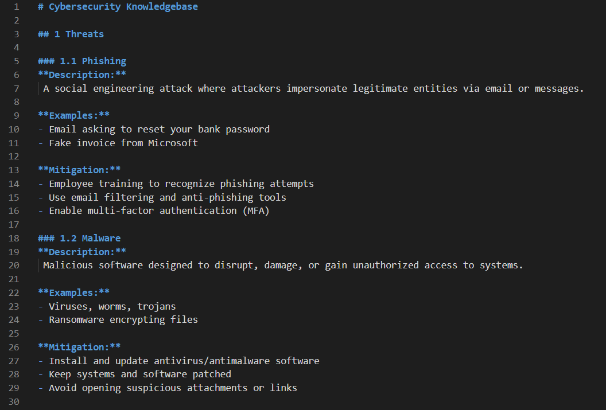
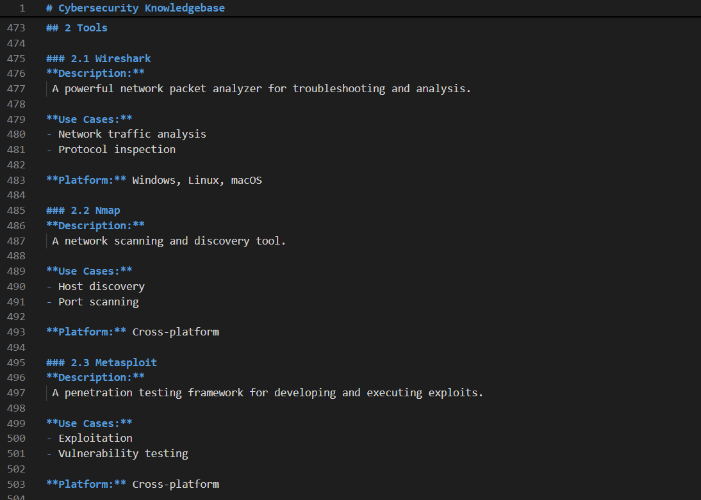
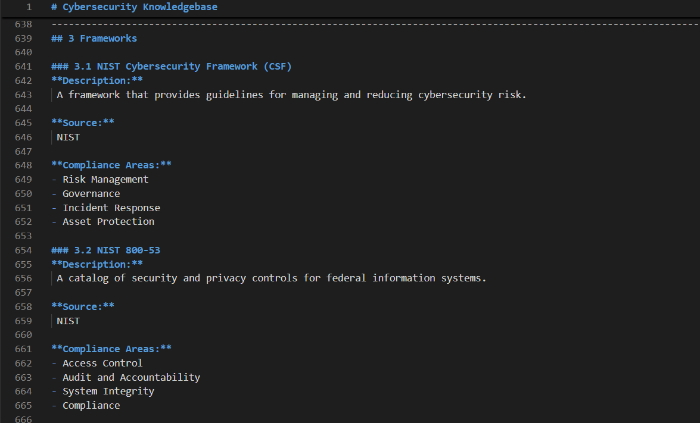

# Cybersecurity Knowledgebase

This project generates a markdown glossary of cybersecurity terms (threats, tools, frameworks) from YAML files using a Python script.

## Project Structure
```
Cybersecurity_Knowledgebase/
├── assets/ # Sample output screenshots
│   └── 1.png
│   └── 2.png
│   └── 3.png
├── data/
│ ├── threats.yaml # YAML data file with cybersecurity threats
│ ├── tools.yaml # YAML data file with cybersecurity tools
│ ├── frameworks.yaml # YAML data file with cybersecurity frameworks
├── scripts/
│ └── builder.py # Script to generate the glossary Markdown file
├── output/
│ └── glossary.md # Generated Markdown glossary (created by script)
├── README.md # This file
```
### How to Run
1. Make sure you have Python installed (tested with Python 3.12).
2. Install PyYAML if you haven't already. 
3. Run the builder script from the scripts directory:
   ```
            python builder.py
   ```
5. The glossary will be generated at output/glossary.md.

#### Example Output Screenshot

Here is how the generated glossary looks in a Markdown viewer: 




## References

The data and information in this knowledgebase are based on authoritative and widely recognized cybersecurity sources, including:

- **OWASP Top 10**  
  https://owasp.org/www-project-top-ten/  
  A list of the most critical web application security risks.

- **MITRE ATT&CK Framework**  
  https://attack.mitre.org/  
  A comprehensive knowledge base of adversary tactics and techniques.

- **NIST Cybersecurity Framework (CSF)**  
  https://www.nist.gov/cyberframework  
  Standards and guidelines for managing cybersecurity risks.

- **CIS Controls**  
  https://www.cisecurity.org/controls/  
  Prioritized actions to improve cybersecurity defenses.

- **SANS Institute Resources**  
  https://www.sans.org/  
  Research and best practices in cybersecurity.

- **Common Vulnerabilities and Exposures (CVE) Database**  
  https://cve.mitre.org/  
  Publicly disclosed cybersecurity vulnerabilities.

- **Splunk Documentation**  
  https://docs.splunk.com/  
  Documentation and use cases for Splunk cybersecurity tools.

- **Wireshark Official Website**  
  https://www.wireshark.org/  
  Resources on network protocol analysis.

- **General Cybersecurity Resources**  
  - Krebs on Security: https://krebsonsecurity.com/  
  - Threatpost: https://threatpost.com/  
  - Cybersecurity and Infrastructure Security Agency (CISA): https://www.cisa.gov/


